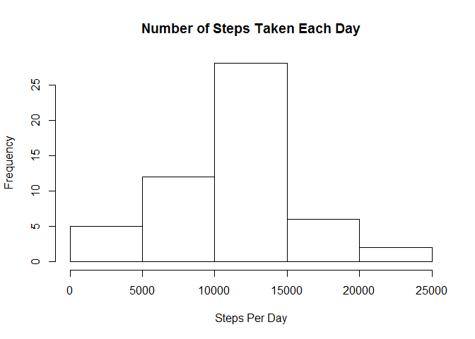

# Reproducible Research: Peer Assessment 1


## Loading and preprocessing the data
We will read in the data, and then group the data by date.  We will then calculate the total number of steps for each date.


```r
library(dplyr)
```

```
## Warning: package 'dplyr' was built under R version 3.2.3
```

```
## 
## Attaching package: 'dplyr'
```

```
## The following objects are masked from 'package:stats':
## 
##     filter, lag
```

```
## The following objects are masked from 'package:base':
## 
##     intersect, setdiff, setequal, union
```

```r
setwd("C:/Users/Nisha/Documents/JHU Data Science/Reproducible Research/RepData_PeerAssessment1/activity")
activityset<-read.csv("activity.csv", colClasses = c("numeric", "character", "numeric"))

date_groups<-group_by(activityset, date)
sumsteps<-summarize(date_groups,sum(steps))
```


## What is mean total number of steps taken per day?

Below is a histogram to represent the total number of steps taken each day

```r
hist(sumsteps$`sum(steps)`, main='Number of Steps Taken Each Day', xlab = 'Steps Per Day')
```

\
We will also calculate the mean and median number of steps taken per day

```r
meansteps<-mean(sumsteps$`sum(steps)`, na.rm=TRUE)
mediansteps<-median(sumsteps$`sum(steps)`, na.rm=TRUE)
meansteps
```

```
## [1] 10766.19
```

```r
mediansteps
```

```
## [1] 10765
```


## What is the average daily activity pattern?
In order to determine the average daily pattern, we will make a time series plot of the 5-minute interval (x-axis) and the average number of steps taken, averaged across all days (y-axis)


```r
## Group the data by interval, and calculate the average number of steps taken during each interval
interval_groups<-group_by(activityset, interval)
avg_interval_groups<-summarize(interval_groups, mean(steps, na.rm=TRUE))

##Plot the average number of steps taken in each interval
plot(avg_interval_groups$interval, avg_interval_groups$`mean(steps, na.rm = TRUE)`, type = "l", xlab='Interval', ylab='Average Steps', main = 'Average Steps Over Time for Each Iterval', axes=FALSE)
axis(side=1, at=seq(0, 2355, by=5))
axis(side=2, at=seq(0, 200, by=50))
```

\

We can also find the 5 minute interval which on average across all the days in the dataset, contains the maximum number of step


```r
max_steps_interval<-subset(avg_interval_groups, avg_interval_groups$`mean(steps, na.rm = TRUE)` == max(avg_interval_groups$`mean(steps, na.rm = TRUE)`))
max_steps_interval$interval
```

```
## [1] 835
```


## Imputing missing values

Given that there are a number of days/intervals where there are missing
values (coded as `NA`). The presence of missing days may introduce
bias into some calculations or summaries of the data.  

In order to mitigate this bias, we will first calculate and report the total number of missing values in the dataset (i.e. the total number of rows with `NA`s)


```r
sum(is.na(activityset))
```

```
## [1] 2304
```

Now, we will utilize a strategy for filling in all of the missing values in the dataset.  The strategy that we utilize will be to use the mean for the 5 minute interval with NAs.  We will create a new dataset that is equal to the original dataset but with the missing data filled in.


```r
new_activity_set<-mutate(activityset, newsteps = ifelse(is.na(steps), avg_interval_groups$`mean(steps, na.rm = TRUE)`, steps))
```

We will now make a histogram of the total number of steps taken each day based on this new dataset


```r
## Group the new data by the date, and calculate the total number of steps for each date
new_date_groups<-group_by(new_activity_set, date)
new_sumsteps<-summarize(new_date_groups,sum(newsteps))

## Make a histogram of the new number of steps taken each day
hist(new_sumsteps$`sum(newsteps)`, main='Number of Steps Taken Each Day Based on no N/A Intervals', xlab = 'Steps Per Day')
```

\

We will also calculate the mean and median number of steps taken per day using this new dataset

```r
new_meansteps<-mean(new_sumsteps$`sum(newsteps)`)
new_mediansteps<-median(new_sumsteps$`sum(newsteps)`)
new_meansteps
```

```
## [1] 10766.19
```

```r
new_mediansteps
```

```
## [1] 10766.19
```

We find that these values do not really differ from the estimates from the first part of the assignment. The impact of using our strategy to fill in missing data is that the frequency of a certain step count per day is higher, however the average step count per day is not impacted.  The reason for this is that the previous average was over a small set of data without NAs.  The new average is over a larger set of data where NAs have been replaced with interval averages, essentially yielding the same results in terms of mean and median.


## Are there differences in activity patterns between weekdays and weekends?

We will first determine whether data was collected on weekends or weekdays by creating a new factor variable called type_of_day, and then we will derive average number of steps for each interval for the weekend subset and the weekday subset

```r
## Add column indicating weekday or weekend
new_activity_set<-mutate(new_activity_set, type_of_day = factor(ifelse(weekdays(as.Date(date))=="Saturday" | weekdays(as.Date(date)) == "Sunday", "Weekend", "Weekday")))

## Subset the data for weekdays and weekends
weekdayset<-subset(new_activity_set, type_of_day == "Weekday")
weekendset<-subset(new_activity_set, type_of_day == "Weekend")

## Group the data by interval, and calculate the average number of steps taken during each interval both weekends and weekdays
interval_groups_weekdays<-group_by(weekdayset, interval)
avg_interval_groups_weekdays<-summarize(interval_groups_weekdays, mean(newsteps))

interval_groups_weekends<-group_by(weekendset, interval)
avg_interval_groups_weekends<-summarize(interval_groups_weekends, mean(newsteps))
```

We will now make a panel plot containing a time series plot of the 5-minute interval (x-axis) and the average number of steps taken, averaged across all weekday days or weekend days (y-axis).


```r
##Panel Plot the average number of steps taken in each weekday interval and weekend interval

par(mfrow=c(2,1))

##Weekday intervals
plot(avg_interval_groups_weekdays$interval, avg_interval_groups_weekdays$`mean(newsteps)`, type = "l", xlab='Interval', ylab='Average Steps', main = 'Average Weekday Steps', axes=FALSE)
axis(side=1, at=seq(0, 2355, by=5))
axis(side=2, at=seq(0, 250, by=50))

##Weekend intervals
plot(avg_interval_groups_weekends$interval, avg_interval_groups_weekends$`mean(newsteps)`, type = "l", xlab='Interval', ylab='Average Steps', main = 'Average Weekend Steps', axes=FALSE)
axis(side=1, at=seq(0, 2355, by=5))
axis(side=2, at=seq(0, 250, by=50))
```

\

We can see from the 2 plots that on weekdays there is one spike early in the day and a smaller spike in the evening.  This may potentially correlate to before and after the work day or school day.  On the weekends we see more spikes throughout waking hours.
